# Architecture Documentation — Codebase Graph Intelligence Platform

## Overview
The **Codebase Graph Intelligence Platform** is a production-grade enterprise code intelligence system featuring Graph RAG, deep multi-language AST parsing, vector search, structural diff analysis, and automated pull request (PR) impact analysis.

```mermaid
flowchart TD
    subgraph Ingestion Pipeline
        A[Repository Ingestion] --> B[Multi-Language AST Parser]
        B --> C[Symbol & Relationship Extraction]
        C --> D[(Neo4j Knowledge Graph)]
        C --> E[Symbol-Aware Chunks]
        E --> F[Hugging Face BGE Embeddings]
        F --> G[(Qdrant Vector Database)]
    end

    subgraph Graph RAG Query Flow
        H[User / API Query] --> I[Query Analyzer & Intent Classifier]
        I --> J[Entity Resolution]
        J --> K[Neo4j Graph Traversal]
        J --> L[Qdrant Semantic Retrieval]
        K & L --> M[Reciprocal Rank Fusion]
        M --> N[Bounded Subgraph Context Construction]
        N --> O[LLM Graph RAG Reasoning]
        O --> P[Grounded Answer Validation]
    end

    subgraph Async PR Automation Architecture
        Q[GitHub / GitLab Webhooks] --> R[X-Hub Signature Authentication]
        R --> S[Action Policy Filter]
        S --> T[Delivery ID Deduplication]
        T --> U[Idempotency Check]
        U --> V[(Redis Queue)]
        V --> W[ARQ Async Worker Process]
        W --> X[Structural & Signature Diff Engine]
        X --> Y[Code Impact Analysis Service]
        Y --> Z[PR Sticky Comment Updates & Run History]
    end
```

## System Components

### 1. Ingestion & Multi-Language Parsing
- **Parsers**: Python AST, Tree-sitter for Go, Java, JavaScript, and TypeScript.
- **Entities Extracted**: Classes, Methods, Functions, Interfaces, Call Relations, Imports, Inheritance.
- **Chunks**: Symbol-aware line-bounded code blocks tied to exact symbol IDs.

### 2. Dual-Database Storage Architecture
- **Neo4j (Knowledge Graph)**: Stores nodes (`File`, `Class`, `Function`, `Module`, `Interface`) and edges (`CALLS`, `INHERITS`, `IMPORTS`, `DEFINES`).
- **Qdrant (Vector Database)**: Stores 384-dimensional `bge-small-en-v1.5` embeddings for semantic chunk retrieval.

### 3. Graph RAG Hybrid Retrieval
- **Query Intent Classifier**: Identifies structural queries vs broad semantic queries.
- **Reciprocal Rank Fusion (RRF)**: Merges graph traversal candidate ranks with vector similarity scores ($k=60$).
- **LangGraph Workflow**: Orchestrates query analysis, retrieval, context fusion, LLM synthesis, and validation.

### 4. Async PR Automation & Worker Queue
- **Webhook Gateway**: Fast ingestion returning `HTTP 202 Accepted` in under 50 ms.
- **Redis & ARQ Workers**: Multi-worker background architecture with exponential retry, failure classification (`transient` vs `permanent`), dead-letter queue, and delivery deduplication.
